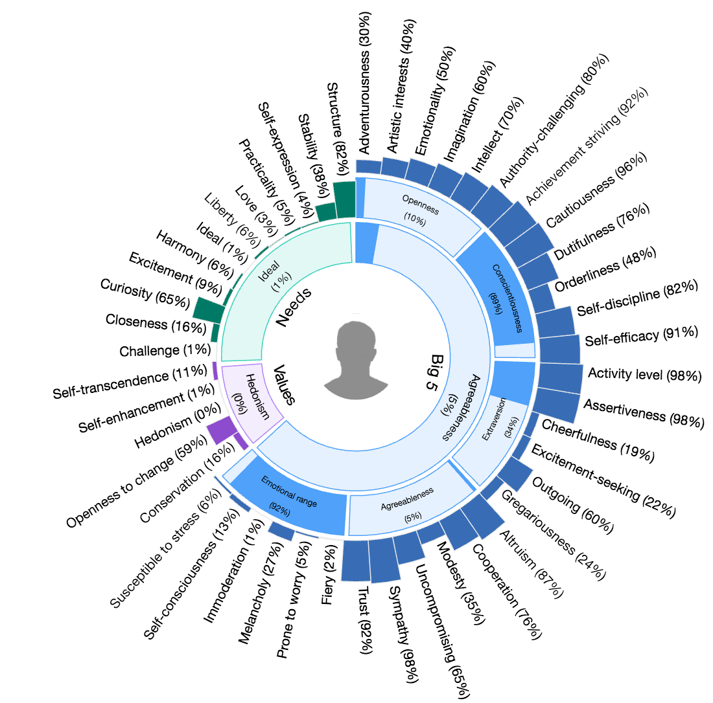

# Personality Sunburst Chart

[](https://www.npmjs.com/package/personality-sunburst-chart)
[](https://www.npmjs.com/package/personality-sunburst-chart)
[](https://travis-ci.org/personality-insights/sunburst-chart)
[](https://codecov.io/github/personality-insights/sunburst-chart?branch=master)

Obtain a sunburst chart visualization for a personality profile.  For use in an HTML page.




## Usage
#### Importing through HTML
Include the library index.js script from the /dist folder and D3 (**v3**) in your HTML page.
```html
<script src="path/to/index.js"></script> <!-- This is the file in the /dist folder. -->
```

Create an element to contain the chart in your HTML page.
```html
<div id='sunburstChart'></div>
```

Generate the visualization for a personality profile.
```JavaScript
  // Create the chart, specifying the css selector that identifies the element to contain the chart
  // and the version of Watson Personality Insights profile to use, v2 or v3.  Default is v2.
  var chart = new PersonalitySunburstChart({
    'selector':'#sunburstChart',
    'version': 'v3'
  });

  // Render the sunburst chart for a personality profile (version as specified in creating the chart)
  // and optionally a profile photo.  The photo will be inserted into the center of the sunburst chart.
  chart.show('jsonObject', 'path/to/profile_photo.jpg');
```

Also works with DOM element input
```JavaScript
  var element = document.querySelector('#sunburstChart');
  var chart = new PersonalitySunburstChart({
    'element': element,
    'version': 'v3'
  });
  chart.show('jsonObject', 'path/to/profile_photo.jpg');
```

See the [complete example](./docs/index.html)

#### Importing through JavaScript
Use one of the following based on your version of Watson Personality Insights and D3
```javascript
// Watson Personality Insights Version 2, D3 Version 3
import PersonalitySunburstChart from 'personality-sunburst-chart/lib/charts/v2-d3v3';

// Watson Personality Insights Version 2, D3 Version 4
import PersonalitySunburstChart from 'personality-sunburst-chart/lib/charts/v2-d3v4';

// Watson Personality Insights Version 3, D3 Version 3
import PersonalitySunburstChart from 'personality-sunburst-chart/lib/charts/v3-d3v3';

// Watson Personality Insights Version 3, D3 Version 4
import PersonalitySunburstChart from 'personality-sunburst-chart/lib/charts/v3-d3v4';
```

## Development
Test changes in the browser:
```bash
npm start
```

Run unit tests:
```bash
npm test
```

## License

This library is licensed under Apache 2.0. Full license text is
available in [LICENSE](LICENSE).

## CHANGELOG

__10-05-2017__
 * Removed d3 from `window`
 * Added to package.json:
   * `"d3":"v3.5.14"`
   * `"d3-color":"^1.0.3"`

__26-01-2017__
 * Removed jQuery
 * Add support for selectors and DOM nodes

__15-01-2017__
 * Added support for v3 profiles - d3 tree json wrapper provided for v2 and v3 personality profiles to generate the input required by the d3 sunburst-chart created in lib/personality-chart-renderer.js
 * Only traits, needs and values will be displayed by the sunburst-chart.
