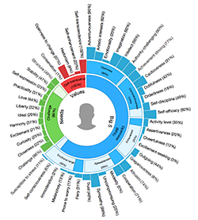

# Personality Sunburst Chart

A visualization for IBM Watson Personality Insights service output. This widget displays personality trait values in a sunburst chart.



## Getting Started

1. **Include the script** in your page
```
<script src="path/to/personality-sunburst-chart.standalone.js"></script>
```
Also, be sure to include the `JQuery` and `D3js` script files.

2. **Add a container** element in your HTML

```
<div id='sunburstChartContainer'></div>
```

3. **Generate the visualization** for a profile.
```
var chart = new PersonalitySunburstChart('sunburstChartContainer');
chart.show(profile, 'path/to/profile_photo.jpg');
```

See the complete [example](./examples/example.html).

## API Method

Public methods:
  - `constructor :: (ContainerId[, Options])` - Creates the `PersonalitySunburstChart` object.
  - `show :: (PIProfile[, ImageURL])` - Renders the visualization for the given profile, optionally including the image in the center.

Where:
  - `ContainerID` is a `String` and refers to the `id` attribute of a HTML component.
  - `Options` is an `Object` with may contain the following attributes:
    - `Options.scale` : The scale of the visualization. Default is `1`.
    - `Options.width` : The width of the visualization container. Default is `100%`.
    - `Options.height`: The height of the visualization container. Default is `100%`.
  - `PIProfile` is a IBM Watson Personality Insights profile which is basically the service JSON output, parsed into a JavaScript `Object`.
  - `ImageURL` is a `String` containing the URL for the image to display in the center of the visualization. Supported formats are PNG, JPEG or SVG.


## Build from source

You can run `gulp` command to build the component. Binaries will be
deployed to `bin`.
